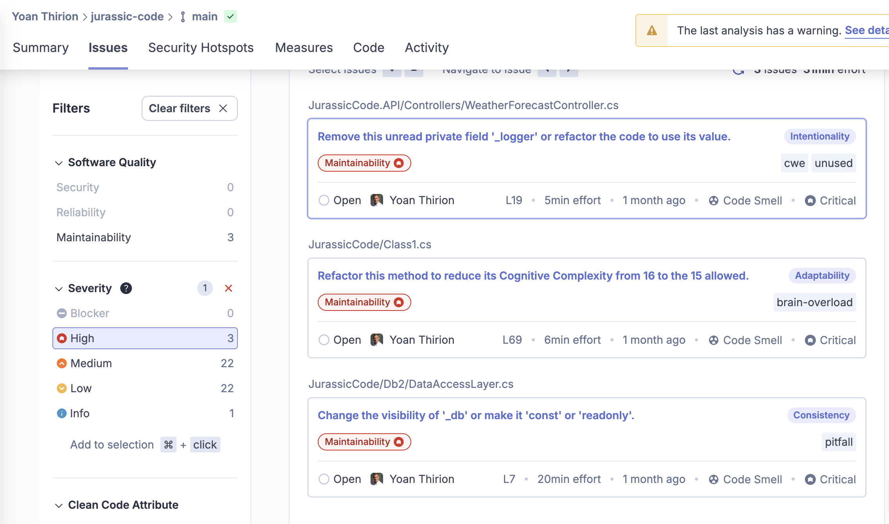

## New code check-list
### Read the `README` / related documentation
  - Pretty quick here, there is none...

### `Compile` to validate that we are able to compile/execute the code
We can run those commands:
```shell
dotnet build JurassicCode.sln
npm install --prefix jurassic-ui 
npm run build --prefix jurassic-ui

// Or use the build.sh script
bash build.sh
```

Here are the results:
- Regarding the back-end part:


- Regarding the `client` part:


### `Analyze potential warnings` during compilation
- Usage of `netcoreapp3.1` which is not supported anymore
> Microsoft.NET.EolTargetFrameworks.targets(32,5): Warning NETSDK1138 : The target framework 'netcoreapp3.1' is out of support and will not receive security updates in the future. Please refer to https://aka.ms/dotnet-core-support for more information about the support policy.

- Warnings in the system:
  - Some identified `vulnerabilities` are found in the `ui` and `api` dependencies
- There are a mix of languages in the system: `C#`, `VB .NET`, `typescript`


### `Analyze the code structure` to understand the architecture


Here are some quick insights:
- 2 `Controllers`: `Park` and `WeatherForecast`
  - Why do we care about Weather here?
- Requests may be the `Dtos`
  - Give an idea of the supported features: `Add Dinosaur`, `Move Dinosaur`, ...
- Usage of Db2
- Why is there a `ReflectionHelper`?
- Bad naming: `Class1`, `Init`
  - What are their purpose?
- Where is the business logic here?
  - Not really a clear architecture from the folder organization...


- Pretty clear organization on the front-end with isolated components
  - It exposes the different exposed features
- `eslint` seems to be used here: quality at heart?
- `vite` is used as well


### Check dependencies to understand potential system interactions
List dependencies for the back-end part:
```shell
dotnet list JurassicCode.sln package
```


Based on it, we can deduct:
- Some integrations are made using [`Kafka`](https://www.nuget.org/packages/confluent.kafka/)
- [`Polly`](https://www.nuget.org/packages/Polly) is used for which purpose? (Circuit breaker, Retry, ...)
- [`Swashbuckle`](https://www.nuget.org/packages/Swashbuckle.AspNetCore) is referenced meaning an `Open API` may be generated to document the `API`
- [`FluentAssertions`](https://www.nuget.org/packages/FluentAssertions) is used in the tests
  - Making them readable?

> Weird stuff: there is no `Db2` connector 🤔

Let's do the same for the front-end:
```shell
npm list --depth=0
```


- Nothing exotic here
- [`axios`](https://www.npmjs.com/package/axios) may be used to call `APIs`

### Run [`LibYear`](https://libyear.com/) analysis to understand dependencies freshness
Resources about how to [Keep Dependencies Up-to-Date](https://xtrem-tdd.netlify.app/Flavours/Practices/keep-dependencies-up-to-date)

```shell
dotnet tool install -g libyear
dotnet libyear
```

> We are almost 42 libyears behind for the back-end part... 


```shell
npx libyear
```

> We are better on the front-end side with a drift lower than 1 libyear 


More info about drift [here](https://github.com/jdanil/libyear?tab=readme-ov-file#metrics).

### Look at the `git log`
Not relevant here because we are on a workshop code 🙃

### Gather metrics
Our tools and development ecosystem allow us to quickly gather metrics to observe the code quality in a fairly factual manner:

#### Retrieve `code coverage`
  - A coverage metric showing how much source code a test suite executes, from none to `100%`


```shell
dotnet tool install --global JetBrains.dotCover.GlobalTool
dotnet dotcover test --dcReportType=HTML JurassicCode.sln
```


> There is a pretty high code coverage on the back-end part with `81%`!!!

There is no test on the `front-end`: code coverage of `0%` here...

#### Review the `tests quality`
We start by reading a random test:

```csharp
[Fact]
// Bad naming: what is the intent here?
// Too many reasons to fail here... making it hard to understand / maintain
public void TestAddAndMoveDinosaursWithZoneToggle()
{
    // Arrange: a lot of Arrange
    // What is relevant in this setup for the outcome of our test?
    DataAccessLayer.Init(new Database());
    // Not clear what is setup with this boolean
    // Hardcoded values
    _parkService.AddZone("Test Zone 1", true);
    _parkService.AddZone("Test Zone 2", false);
    
    _parkService.AddDinosaurToZone("Test Zone 1", new Dinosaur { Name = "TestDino1", Species = "T-Rex", IsCarnivorous = true });
    _parkService.AddDinosaurToZone("Test Zone 1", new Dinosaur { Name = "TestDino2", Species = "Velociraptor", IsCarnivorous = true });

    // Act
    Action moveToClosedZone = () => _parkService.MoveDinosaur("Test Zone 1", "Test Zone 3", "TestDino1");
    // Assert
    moveToClosedZone.Should().Throw<Exception>().WithMessage("Zones are closed or do not exist.");

    // Arrange
    _parkService.ToggleZone("Test Zone 2");
    // Act
    _parkService.MoveDinosaur("Test Zone 1", "Test Zone 2", "TestDino1");

    // Assert
    var zone2Dinosaurs = _parkService.GetDinosaursInZone("Test Zone 2");
    zone2Dinosaurs.Should().Contain(d => d.Name == "TestDino1");
    var zone1Dinosaurs = _parkService.GetDinosaursInZone("Test Zone 1");
    zone1Dinosaurs.Should().NotContain(d => d.Name == "TestDino1");

    // Assert another behavior
    bool canCoexist = _parkService.CanSpeciesCoexist("T-Rex", "Velociraptor");
    canCoexist.Should().BeFalse();
    canCoexist = _parkService.CanSpeciesCoexist("Triceratops", "Velociraptor");
    canCoexist.Should().BeTrue();

    // Assert another behavior
    _parkService.ToggleZone("Test Zone 1");
    Action addToClosedZone = () => _parkService.AddDinosaurToZone("Test Zone 1", new Dinosaur { Name = "TestDino3", Species = "Triceratops", IsCarnivorous = false });
    addToClosedZone.Should().Throw<Exception>().WithMessage("Zone is closed or does not exist.");
}
```

#### Mutation Testing
Let's gather metrics on the test by using the [`Mutation Testing`](https://xtrem-tdd.netlify.app/Flavours/Testing/mutation-testing) technique.
- It will test our tests by introducing MUTANTS (fault) into our production code during the test execution:
  - To check that the test is failing
  - If the test pass, there is an issue
- We can introduce mutants manually
  - When working on legacy code for example
  - When doing some TDD

Coverage metrics are a good negative indicator but a bad positive one:
- Too little coverage in your code base -> 10%
- Demonstrates you are not testing enough
- The reverse isn’t true
  - Even 100% coverage isn’t a guarantee that you have a good-quality test suite...

Here are the steps:
- `Step 1`: Generate mutants


- `Step 2`: Kill them all
  - Check that all your tests are green on the non-mutated business code
  - Take the mutants one by one
    - Place them in front of the wall of the shot
    - Fire a salvo of unit tests
- `Step 3`: Make the assessment
  - Who survived? Who was killed?
  - If your tests fail then the mutant is killed
  - If your tests passed, the mutant survived

```gherkin
As a mutant code
When tests are launched
I am detected
So the code is correctly tested

As a mutant code
When tests are launched
I am NOT detected
So the code is NOT correctly tested
```


> The higher the percentage of mutants killed, the more effective your tests are.

Let's run it:
```shell
dotnet stryker
```

> The result is bad with a mutation score at `43.26%` 😱


Here is the detailed report with explanations:


- `Killed`: At least one test failed while this mutant was active.
  - The mutant is killed. This is what you want, good job!
- `Survived`: When all tests passed while this mutant was active, the mutant survived
- `Timeout`: The running of tests with this mutant active resulted in a timeout.
  - For example, the mutant resulted in an infinite loop in your code.
- `No coverage`: The mutant isn't covered by one of your tests and survived as a result.
- `Ignored`: The mutant wasn't tested because it is ignored.
  - Not count against your mutation score but will show up in reports.

[](https://dashboard.stryker-mutator.io/reports/github.com/ythirion/jurassic-code/main)

#### Set up a `static code analysis` tool
We can use [`SonarCloud`](https://www.sonarsource.com/products/sonarcloud/) to gather some metrics on our code:
- `Bugs`
- `Cyclomatic Complexity`
- `Code Smells`
- ...

Analysis has been configured and available [here](https://sonarcloud.io/summary/new_code?id=ythirion_jurassic-code)


Here are some insights from it:
- `3300` lines of code: `2390` in ui, `41.7%` of duplication in `JurassicCode`
- 4 weak Security Hotspots regarding usage of randomness
- `3 high issues` related to:
  - `Cognitive complexity`
  - `Unused private field`
  - `Encapsulation issue`



- `B` ranking for `Reliability` regarding this usage:

```csharp
// No encaspulation
// Dictionary can be mutated from the outside world
public readonly Dictionary<string, Entities.ZoneEntity> Zones = new Dictionary<string, Entities.ZoneEntity>();
```

[](https://sonarcloud.io/summary/new_code?id=ythirion_jurassic-code) [](https://sonarcloud.io/summary/new_code?id=ythirion_jurassic-code) [](https://sonarcloud.io/summary/new_code?id=ythirion_jurassic-code)

### Identify `hotspots`
Conceptually, here is what we call a `Hotspot`:


There are 3 things to identify `Hotspots`:
- Calculate the Code Complexity for each file
- Calculate the Churn score for each file
- Cross the data to identify them

We use the platform developed by `Adam Tornhill` called [`codescene`](https://codescene.com/) enabling `behavioral code analysis`:


The `Code Health` score is pretty high at `9.6` (on 10).

Let's identify the `Hotspots`:


> The biggest file seems to be `index.ts` and the biggest hotspot is `Class1.cs` 🤨


This file is also identified as a `Refactoring Target` with a problematic `Code Health` at `8.41` because it:
- Violates 2 rules:
  - `Bumpy Road`: A Bumpy Road is a function that contains multiple chunks of nested conditional logic inside the same function. The deeper the nesting and the more bumps, the lower the code health.
  - `Deep, Nested Complexity: Deep nested logic means that you have control structures like if-statements or loops inside other control structures.
- Contains 2 warnings:
  - `Many Conditionals`: Overall Code Complexity is measured by the mean cyclomatic complexity across all functions in the file. The lower the number, the better.
  - `Complex Method`: A Complex Method has a high cyclomatic complexity. The recommended threshold for the C# language is a cyclomatic complexity lower than 9.

With the `behavioral analysis` we can also identify `Knowledge Risks`:


> Everything is a knowledge island meaning that only 1 person has worked on it...

[](https://codescene.io/projects/65105)[](https://codescene.io/projects/65105)[](https://codescene.io/projects/65105) [](https://codescene.io/projects/65105)

## Resources
- [Mutation Testing technique explained](https://xtrem-tdd.netlify.app/Flavours/Testing/mutation-testing)
- [Stryker - mutation tool](https://stryker-mutator.io/docs/stryker-net/introduction/)
- [SonarCloud](https://www.sonarsource.com/products/sonarcloud/)
- [Focus refactoring on what matters with Hotspots Analysis by Nicolas Carlo](https://understandlegacycode.com/blog/focus-refactoring-with-hotspots-analysis/)
- [Codescene platform](https://codescene.com/)
- Books:
  - [Software Design X-Rays by Adam Tornhill](https://pragprog.com/titles/atevol/software-design-x-rays/)
  - [Your Code as a Crime Scene by Adam Tornhill](https://pragprog.com/titles/atcrime2/your-code-as-a-crime-scene-second-edition/)