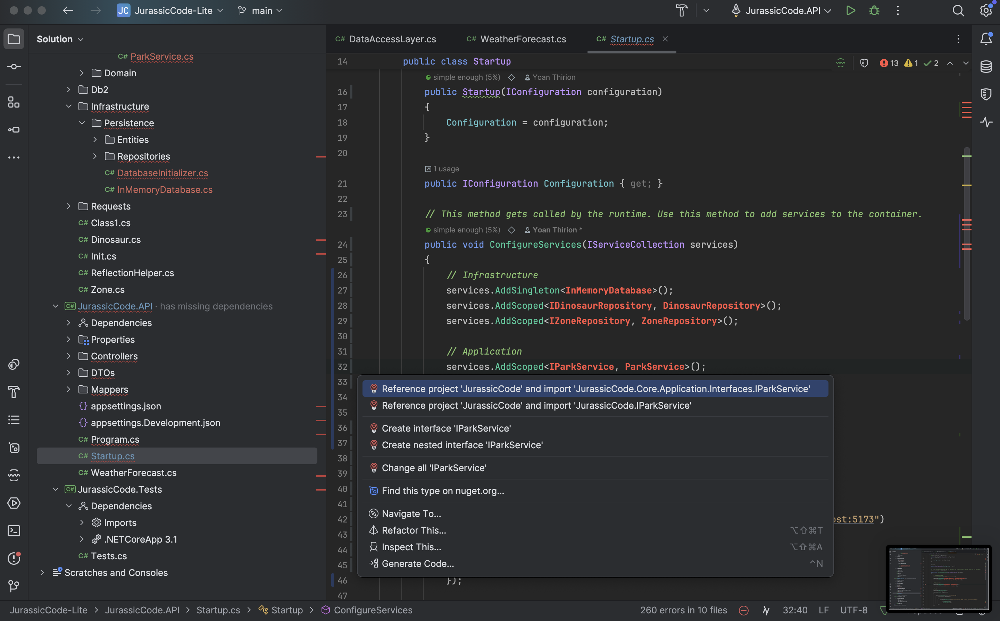

## Clean Architecture
`Claude` has moved some code in `Domain` and better encapsulate it: 

```csharp
namespace JurassicCode.Core.Domain;

public class Zone
{
    private readonly List<Dinosaur> _dinosaurs = new();

    public Zone(string name, bool isOpen = false)
    {
        if (string.IsNullOrWhiteSpace(name))
            throw new ArgumentException("Zone name cannot be empty", nameof(name));

        Name = name;
        IsOpen = isOpen;
    }

    // Encapsulation
    public string Name { get; }
    public bool IsOpen { get; private set; }
    public IReadOnlyCollection<Dinosaur> Dinosaurs => _dinosaurs.AsReadOnly();
    public string Status => IsOpen ? "Open" : "Closed";

    // Business behaviors (methods)
    public void Open() => IsOpen = true;
    
    public void Close() => IsOpen = false;
    
    public void Toggle() => IsOpen = !IsOpen;

    public bool AddDinosaur(Dinosaur dinosaur)
    {
        if (!IsOpen)
            return false;

        if (_dinosaurs.Any(d => d.Name == dinosaur.Name))
            return false;

        _dinosaurs.Add(dinosaur);
        return true;
    }

    public bool RemoveDinosaur(string dinosaurName)
    {
        var dinosaur = _dinosaurs.FirstOrDefault(d => d.Name == dinosaurName);
        if (dinosaur == null)
            return false;

        return _dinosaurs.Remove(dinosaur);
    }

    public Dinosaur GetDinosaur(string name) => 
        _dinosaurs.FirstOrDefault(d => d.Name == name);

    public bool ContainsDinosaur(string name) => 
        _dinosaurs.Any(d => d.Name == name);
}
```

- Created `Repositories` using `InMemoryDatabase`
  - `Entities` to store data

```csharp
public interface IDinosaurRepository
{
    Task<IEnumerable<Dinosaur>> GetDinosaursInZoneAsync(string zoneName);
    Task<Dinosaur> GetDinosaurByNameAsync(string dinosaurName);
    Task<bool> AddDinosaurToZoneAsync(string zoneName, Dinosaur dinosaur);
    Task<bool> RemoveDinosaurFromZoneAsync(string zoneName, string dinosaurName);
    Task<bool> MoveDinosaurBetweenZonesAsync(string fromZoneName, string toZoneName, string dinosaurName);
}

public class DinosaurEntity
{
    public string Name { get; set; }
    public string Species { get; set; }
    public bool IsCarnivorous { get; set; }
    public bool IsSick { get; set; }
    public DateTime LastFed { get; set; }
}
```

- `ParkService` is now in its own file and ensures `Tell Don't Ask Principle`:

```csharp
public async Task<bool> ToggleZoneAsync(string zoneName)
{
    // Defensive code
    if (string.IsNullOrWhiteSpace(zoneName))
        throw new ArgumentException("Zone name cannot be empty", nameof(zoneName));

    var zone = await _zoneRepository.GetZoneByNameAsync(zoneName);
    if (zone == null)
        throw new InvalidOperationException($"Zone '{zoneName}' does not exist");

    // Tell to the domain entity what to do
    zone.Toggle();
    return await _zoneRepository.UpdateZoneAsync(zone);
}
```

Unfortunately, it does not compile



- It has not removed previous `ParkService` class
- Some of the added methods are not well encapsulated (can not be accessed from outside)
- It has not introduced Business `Use Cases`
- Tests are still using previous data access layer...
- ...

> Let's iterate on our prompt.