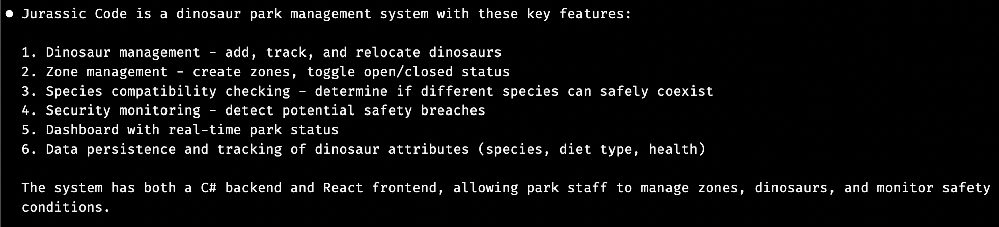
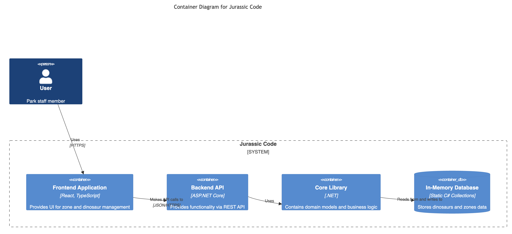
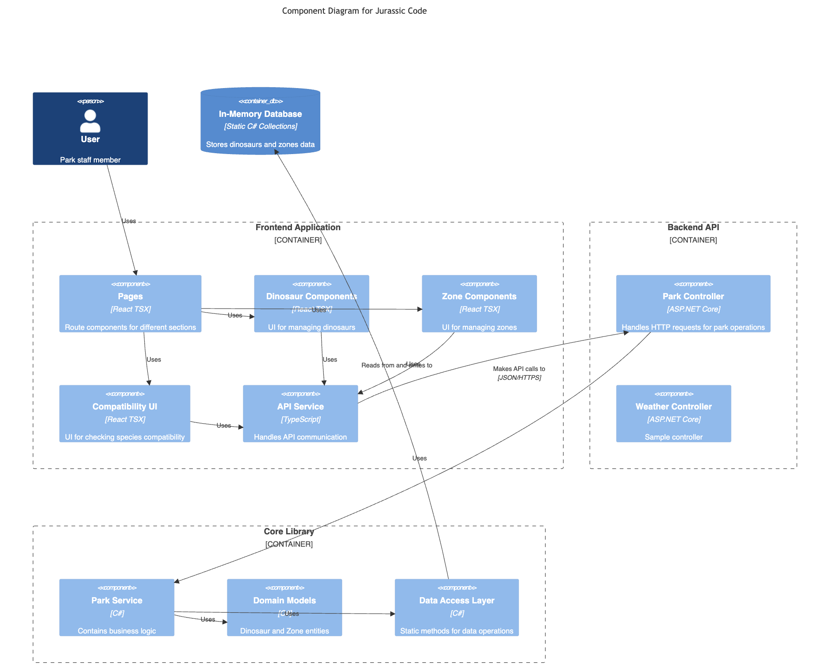
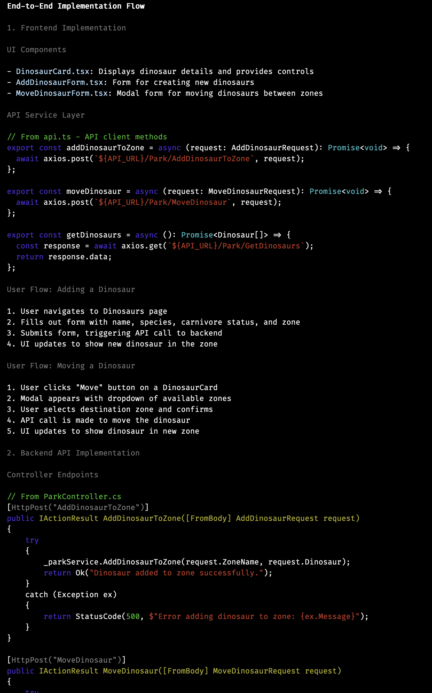
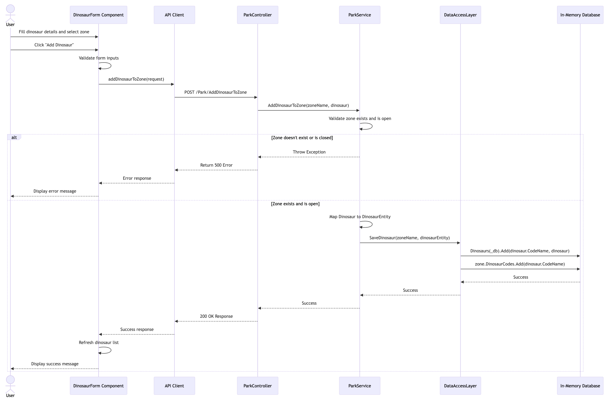

## Gather some insights on the product
```prompt
Explain the product: Which features are covered by the product
```

```result
⏺ Jurassic Code is a dinosaur park management system with these key features:

1. Dinosaur management - add, track, and relocate dinosaurs
2. Zone management - create zones, toggle open/closed status
3. Species compatibility checking - determine if different species can safely coexist
4. Security monitoring - detect potential safety breaches
5. Dashboard with real-time park status
6. Data persistence and tracking of dinosaur attributes (species, diet type, health)

The system has both a C# backend and React frontend, allowing park staff to manage zones, dinosaurs, and monitor safety
conditions.
```



### In-depth
```prompt
Explain the product: I want to know which features are covered by the product.
For that purpose create a Backlog.md file presenting all of them with a detailed Backlog.
For each Item / Feature, I want :
- A title
- A description of the goal written with the User Story foramt
- Acceptance Criteria
- Examples / Test Cases that may have been used to create the feature 
```

A detailed backlog has been created [here](01.backlog.md)

## Explain the architecture
```prompt
Explain the architecture
```

```result
⏺ The Jurassic Code application follows a client-server architecture with the following components:

  Backend (.NET Core)

  1. Project Structure:
    - JurassicCode: Core library with domain models and business logic
    - JurassicCode.API: Web API exposing endpoints
    - JurassicCode.Tests: Test project for validation
  2. Key Components:
    - Domain Models (Dinosaur.cs, Zone.cs): Core entities
    - ParkController: REST API endpoints for park management
    - Data Layer: Static in-memory database in Db2 namespace
  3. Data Persistence:
    - Uses an in-memory database (Database.cs)
    - Static DataAccessLayer with global state
    - Uses reflection to access private fields (anti-pattern)

  Frontend (React/TypeScript)

  1. Component Organization:
    - Feature-based folders: /dinosaurs, /zones, /compatibility
    - Pages: Dashboard, Zones, Dinosaurs, Compatibility
    - Layout and styled components
  2. State Management:
    - Uses React's state with API communication through api.ts
    - No global state management like Redux

  Communication

  - REST API with JSON payloads
  - Request/Response DTOs in the Requests folder
  - Frontend service layer in api.ts

  Architectural Issues

  - Static data access with global state
  - Reflection for accessing private fields
  - Limited dependency injection
  - Mutable domain models without validation
  - Inconsistent error handling
```

### In-depth
```prompt
Explain the software architecture by describing the main components of the system using C4 diagrams that you generate with mermaid syntax.
Create 1 diagram for each of the following levels:
- Context
- Containers
- Components
- Code
```

The C4 model is a framework for visualizing the architecture of software systems. It consists of four levels of abstraction:
Here is some documentation regarding the [C4 Model](https://c4model.com/) by Simon Brown.

The diagrams are generated using the [mermaid](https://mermaid-js.github.io/mermaid/#/) syntax, which is a JavaScript-based diagramming and charting tool that uses Markdown-inspired text definitions.
Detailed result is available [here](02.C4.md).

Here is a preview of the diagrams:




## Detail a flow
```prompt
Explain in-depth the "Dinosaur management" feature implementation from front to back.
```



> At this stage, I don't necessarily want to know the code, but I want to understand the flow of the feature.

Detailed result [here](03.dinosaur-management.md)

### In-depth
```prompt
Explain in-depth the "Dinosaur management" feature implementation from front to back.
Generate a sequence diagram using mermaid syntax.
```



Detailed result [here](03.dinosaur-sequence.md)