## Gather some insights on the product
```prompt
Explain the product: Which features are covered by the product
```

```result
‚è∫ Jurassic Code is a dinosaur park management system with these key features:

1. Dinosaur management - add, track, and relocate dinosaurs
2. Zone management - create zones, toggle open/closed status
3. Species compatibility checking - determine if different species can safely coexist
4. Security monitoring - detect potential safety breaches
5. Dashboard with real-time park status
6. Data persistence and tracking of dinosaur attributes (species, diet type, health)

The system has both a C# backend and React frontend, allowing park staff to manage zones, dinosaurs, and monitor safety
conditions.
```


### In-depth
```prompt
Explain the product: I want to know which features are covered by the product.
For that purpose create a Backlog.md file presenting all of them with a detailed Backlog.
For each Item / Feature, I want :
- A title
- A description of the goal written with the User Story foramt
- Acceptance Criteria
- Examples / Test Cases that may have been used to create the feature 
```

A detailed backlog has been created [here](01.backlog.md)

## Explain the architecture
```prompt
Explain the architecture
```

```result
‚è∫ The Jurassic Code application follows a client-server architecture with the following components:

  Backend (.NET Core)

  1. Project Structure:
    - JurassicCode: Core library with domain models and business logic
    - JurassicCode.API: Web API exposing endpoints
    - JurassicCode.Tests: Test project for validation
  2. Key Components:
    - Domain Models (Dinosaur.cs, Zone.cs): Core entities
    - ParkController: REST API endpoints for park management
    - Data Layer: Static in-memory database in Db2 namespace
  3. Data Persistence:
    - Uses an in-memory database (Database.cs)
    - Static DataAccessLayer with global state
    - Uses reflection to access private fields (anti-pattern)

  Frontend (React/TypeScript)

  1. Component Organization:
    - Feature-based folders: /dinosaurs, /zones, /compatibility
    - Pages: Dashboard, Zones, Dinosaurs, Compatibility
    - Layout and styled components
  2. State Management:
    - Uses React's state with API communication through api.ts
    - No global state management like Redux

  Communication

  - REST API with JSON payloads
  - Request/Response DTOs in the Requests folder
  - Frontend service layer in api.ts

  Architectural Issues

  - Static data access with global state
  - Reflection for accessing private fields
  - Limited dependency injection
  - Mutable domain models without validation
  - Inconsistent error handling
```

### In-depth
```prompt
Explain the software architecture by describing the main components of the system using C4 diagrams that you generate with mermaid syntax.
Create 1 diagram for each of the following levels:
- Context
- Containers
- Components
- Code
```

The C4 model is a framework for visualizing the architecture of software systems. It consists of four levels of abstraction:
Here is some documentation regarding the [C4 Model](https://c4model.com/) by Simon Brown.

The diagrams are generated using the [mermaid](https://mermaid-js.github.io/mermaid/#/) syntax, which is a JavaScript-based diagramming and charting tool that uses Markdown-inspired text definitions.
Detailed result is available [here](02.C4.md).

Here is a preview of the diagrams:


## Detail a flow
```prompt
Explain in-depth the "Dinosaur management" feature implementation from front to back.
```


> At this stage, I don't necessarily want to know the code, but I want to understand the flow of the feature.

Detailed result [here](03.dinosaur-management.md)

### In-depth
```prompt
Explain in-depth the "Dinosaur management" feature implementation from front to back.
Generate a sequence diagram using mermaid syntax.
```


Detailed result [here](03.dinosaur-sequence.md)

## Rate Code Quality
```prompt
Rate code: Score code quality
```

```result
1. Architecture and Design: 3/10
2. Code Organization and Style: 4/10
3. Code Smells and Anti-Patterns: 2/10
4. Performance Considerations: 5/10
5. Testing: 6/10
6. Frontend Code Quality: 7/10

Overall score: 4/10
```

> Once again, it may go into too many details at this stage.

Detailed result [here](04.code-quality.md)

### In-depth
```prompt
Examine the code as a software craft coach with 20 years of experience. 
Rate the source code quality based on Clean Code, SOLID, DRY, OOP, Gof, FP principles, etc.
You will respond by giving the code a letter grade (A, B+, D-, etc...), listing smells (name only).
```

More about code smells with [refactoring guru](https://refactoring.guru/fr/refactoring/smells).

Here is a clear overview of the main blockers in this repository:

```result
‚è∫ Grade: D-

  Code smells:
  - Anemic Domain Model
  - Primitive Obsession
  - Global State
  - Broken Encapsulation
  - Inappropriate Intimacy (reflection)
  - God Class
  - Shotgun Surgery
  - Arrow Code
  - Singleton Abuse
  - Feature Envy
  - Law of Demeter Violation
  - DIP Violation
  - SRP Violation
  - Mutable State
  - Collection Exposure
  - Temporal Coupling
  - Leaky Abstraction
  - Foreign Language Comments
  - Magic Numbers/Strings
  - Exception Handling Smell
  - Duplicate Code
  - Business Logic in UI

  The code exhibits fundamental violations of software design principles making it brittle, difficult to maintain, and challenging to extend.
```

## Clean the code
```prompt
Clean the code
```

The result is a cleanup plan that may be relevant at one point.

```result
‚è∫ I've created a comprehensive cleanup plan in the file cleanup-plan.md that addresses the major issues in the codebase. The plan is structured in four phases:

  1. Architectural Restructuring:
    - Remove static state and implement proper DI
    - Eliminate reflection usage
    - Create proper domain model abstraction
  2. Domain Model Improvement:
    - Fix mutable domain models
    - Address primitive obsession
    - Enforce collection encapsulation
  3. Service Layer Cleanup:
    - Break down the God Class (ParkService)
    - Replace manual loops with LINQ
    - Implement consistent error handling
  4. Controller and UI Improvements:
    - Implement proper input validation
    - Fix exception handling in controllers
    - Move business logic out of UI components
```

Detailed plan [here](05.cleanup-plan.md).

### In-depth
At this stage, I would like to identify and clean useless dependencies, dead code and unused files.

```prompt
Clean the code by identifying useless dependencies, dead code and unused files.
```

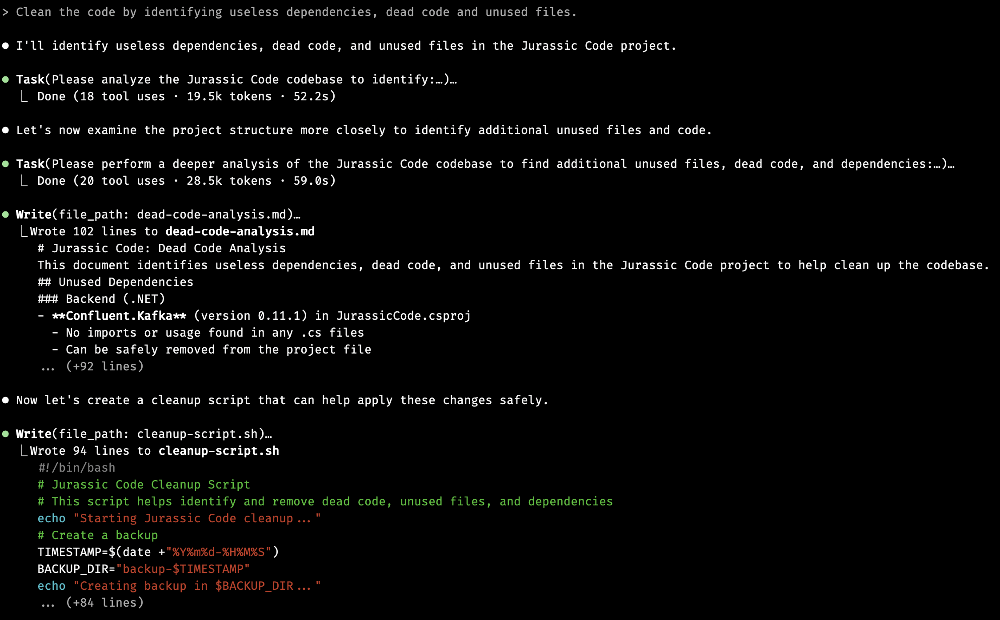

It has created some files for us:
- [dead-code-analysis.md](cleanup/dead-code-analysis.md): A detailed analysis of dead code including
  - Unused dependencies
  - Dead code
  - Unused files
  - Recommended Cleanup Actions
- [cleanup-summary.md](cleanup/cleanup-summary.md): A summary of the cleanup plan
- [component-cleanup.md](cleanup/component-cleanup.md): A detailed analysis of the components
- [cleanup-script.sh](cleanup/cleanup-script.sh): A shell script to automate this cleanup

Let's run the script to clean the code:
```bash
sh claude/cleanup/cleanup-script.sh
```

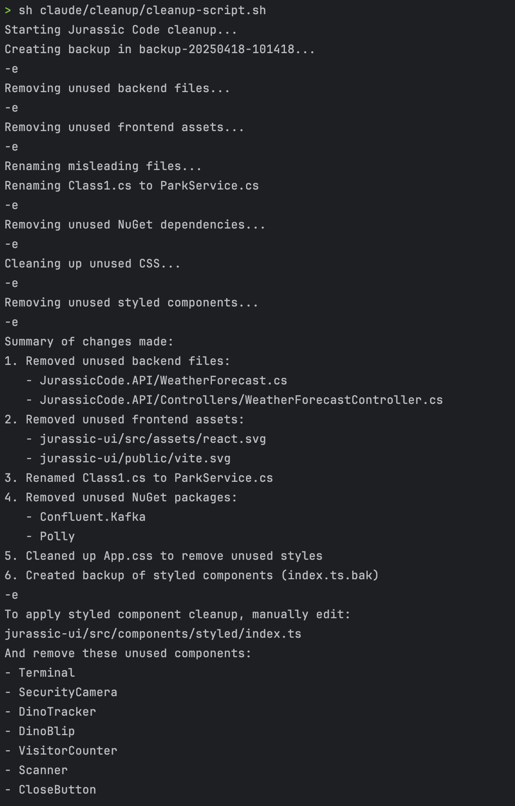

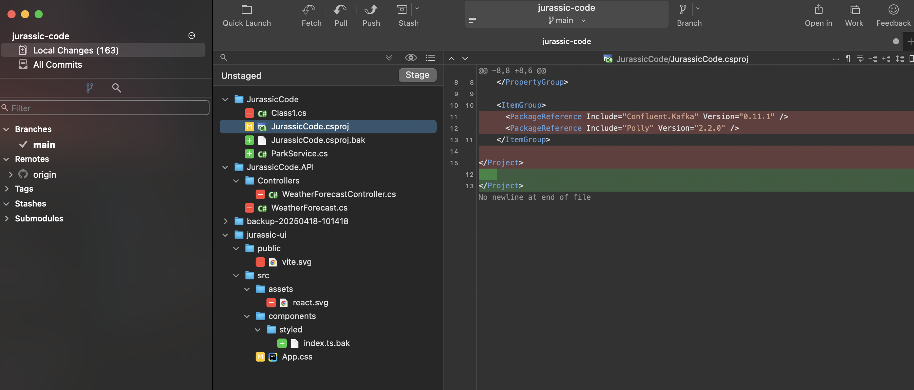

> Oups it seems that the script broke the csproj file. Let's fix it.

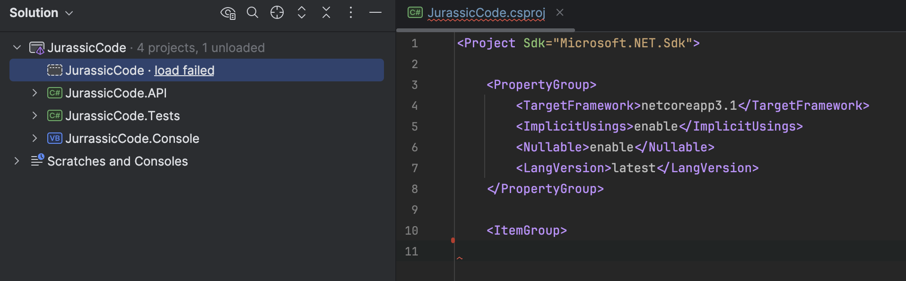

```xml
<Project Sdk="Microsoft.NET.Sdk">
    <PropertyGroup>
        <TargetFramework>netcoreapp3.1</TargetFramework>
        <ImplicitUsings>enable</ImplicitUsings>
        <Nullable>enable</Nullable>
        <LangVersion>latest</LangVersion>
    </PropertyGroup>
</Project>
```

The front and back are now patched with fewer files and dependencies 🦕

## Generate tests
```prompt
generate tests to increase code coverage before adding new feature and iterating on this code
```

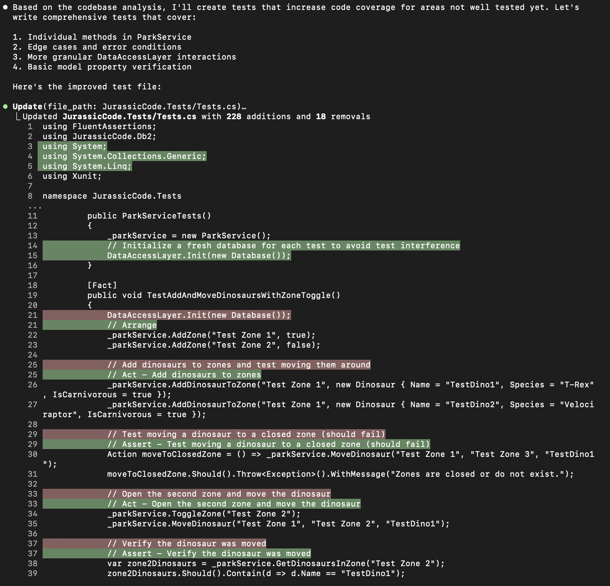

Generated tests available [here](06.generated-tests.md) result.

Poor quality tests are persisted in the `tests` folder...

### In-depth
```prompt
Generate tests to increase code coverage before adding new feature and iterating on this code.
Iterate on the existing ones as well to increase their quality.

Those tests must be at different levels :

- Use Case testing : validate business logic at the lower level
	- Design 1 test class per supported Use Case
	- Inside each test class split the tests in passing / failing (in an inner class)
		- Failing test cases must be specified so that is fluent to read 

public class Remove_A_Dinosaur 
{
	...
	
	public class Fail 
	{
		[Fact]
		public void When_No_Dinosaur_Found() 
		{
			...
		}
	}
}

- Integration Testing (at the API level) : validate integration between back-end layers in black box mode
  - Validate basic test cases by using "Verify" library and check only the serialized json result
  - Check for failure what is the result code and the corresponding answer
  - Failing test cases must be specified so that is fluent to read
- Front testing : add a basic smoke test using playwright in the jurassic-ui in typescript
  - The purpose of this test is to ensure that the app is starting well and the actions are available to the users


Make sure that the tests are ensuring the 3A pattern and are behaviors oriented :
- Arrange
- Act
- Assert

Do not write any comments in tests. they must be self-sufficient.

You can use Verify to implement characterization tests when it does make sense.

Create Test Data Builders that are business oriented to help instantiate objects for our tests :

[BAD]
var address = new AddressBuilder()
    .WithoutStreet()
    .WithoutPostalCode()
    .WithCity("Paris")
    .Build();
    
 
[GOOD]
var address = ANewAddress()
	.At("Bordeaux")
	.InStreet("Rue Sainte Catherine")
	.WithPostalCode(_ => _.WithNumber("1 Bis"))
	.Build();   

In the Builders expose only what is relevant for the purpose of the tests : example a dino name should not condition the result of a business behavior.

[BAD]
var dinosaur = ATRex().WithName("Rexy").Build();

[GOOD]
// Name is not relevant for the beh
var dinosaur = ATRex().Build();

Assertions must be business oriented as well.
Do not write them with Fluent Assertions and favor a more expressive way to assert changes. Do this by creating Extensions methods like described below :

[BAD]
targetZoneDinosaurs.Should().Contain(d => d.Name == dinosaur.Name);

[GOOD]
targetZoneDinosaurs.MustContain(dinosaur.Name);

[BAD]
var zones = _parkService.GetAllZones();
zones.Should().Contain(z => z.Name == zoneName && z.IsOpen == isOpen);

[Good]
var zones = _parkService.GetAllZones();
// An extension method
zones.HasAnOpenZone(zoneName);

They should focus on state changes and not verify an entire object graph -> what is expected as a state mutation.


Be sure to generate business oriented tests to put quality inside and be sure that mutation testing won't identify anything.
```

It creates:
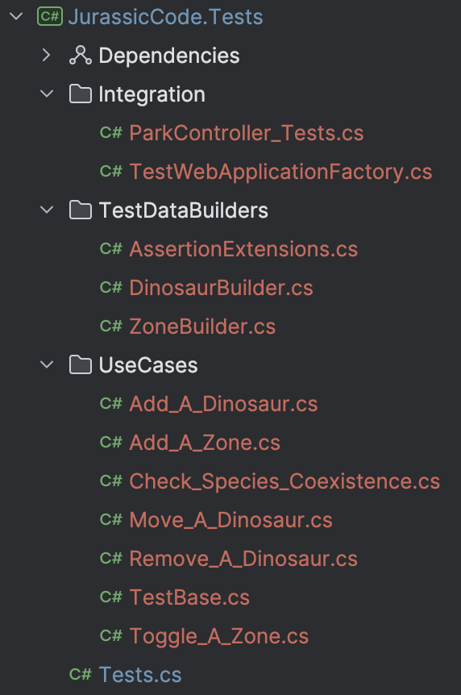

> At first run the project did not compile anymore... I had to ask `Claude` to fix it

> The tests are failing... #nomagic

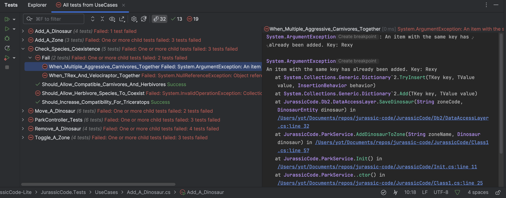

Tests are not reliable. We have not the same results depending on the way we run them...

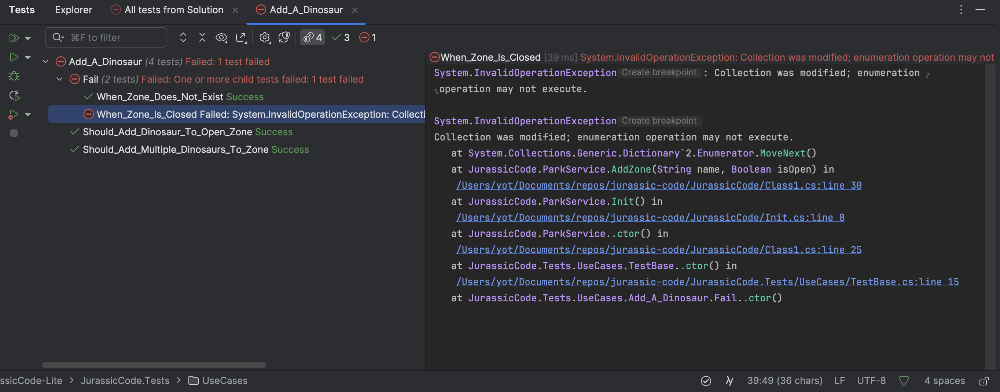

Regarding the frontend, it created a test using Playwright:

```typescript
@@ -0,0 +1,51 @@
import { test, expect } from '@playwright/test';

test.describe('Jurassic Park UI Smoke Tests', () => {
  test('should load the dashboard page', async ({ page }) => {
    await page.goto('/');
    
    await expect(page.locator('h1')).toContainText('Park Dashboard');
    await expect(page).toHaveTitle(/Jurassic Park/);
  });

  test('should navigate between main pages', async ({ page }) => {
    await page.goto('/');
    
    // Navigation menu should be visible
    const navigation = page.locator('nav');
    await expect(navigation).toBeVisible();
    
    // Navigate to Zones page
    await page.getByRole('link', { name: 'Zones' }).click();
    await expect(page.locator('h1')).toContainText('Zones');
    
    // Navigate to Dinosaurs page
    await page.getByRole('link', { name: 'Dinosaurs' }).click();
    await expect(page.locator('h1')).toContainText('Dinosaurs');
    
    // Navigate to Compatibility page
    await page.getByRole('link', { name: 'Compatibility' }).click();
    await expect(page.locator('h1')).toContainText('Compatibility');
    
    // Navigate back to Dashboard
    await page.getByRole('link', { name: 'Dashboard' }).click();
    await expect(page.locator('h1')).toContainText('Park Dashboard');
  });
  
  test('should display core UI components', async ({ page }) => {
    await page.goto('/zones');
    
    // Check if add zone form exists
    const addZoneForm = page.locator('form').filter({ hasText: 'Add Zone' });
    await expect(addZoneForm).toBeVisible();
    
    // Go to dinosaurs page and check if add dinosaur form exists
    await page.goto('/dinosaurs');
    const addDinoForm = page.locator('form').filter({ hasText: 'Add Dinosaur' });
    await expect(addDinoForm).toBeVisible();
    
    // Check if move dinosaur form exists
    const moveDinoForm = page.locator('form').filter({ hasText: 'Move Dinosaur' });
    await expect(moveDinoForm).toBeVisible();
  });
});
```

Unfortunately, it does not work as expected. We will need to fix it.

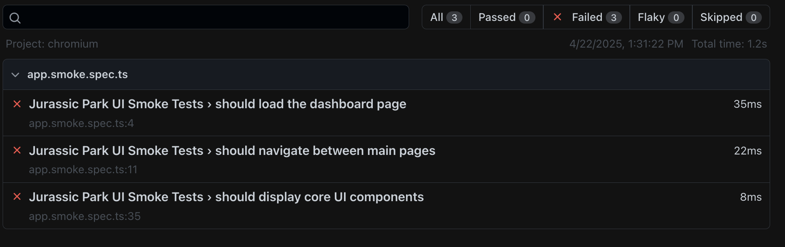

Here is why:
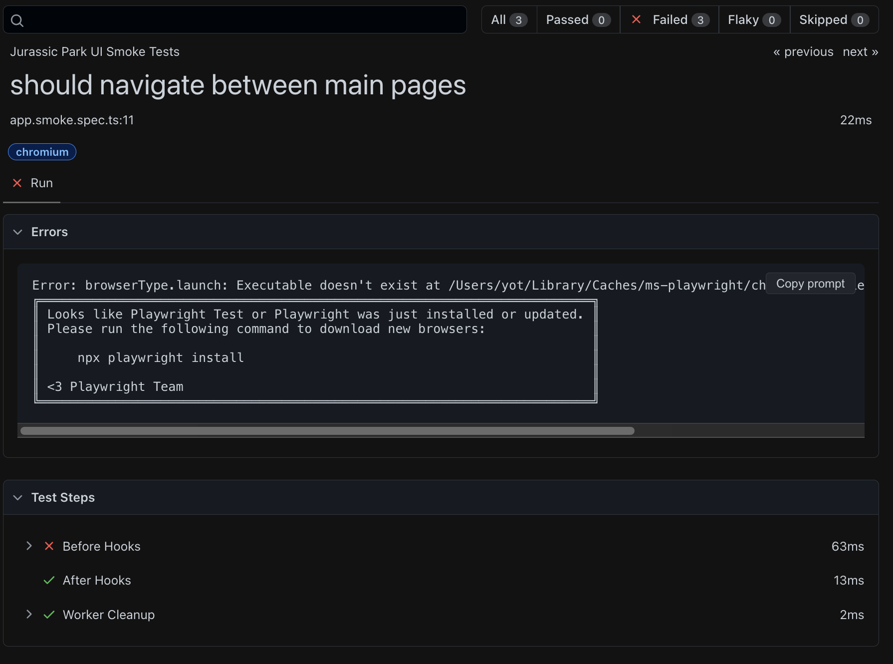

Here is the cost:
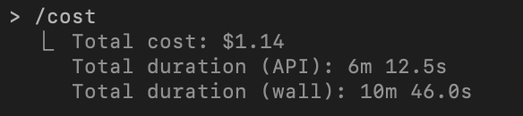

Result code is available under `/generated-tests`.

## Use Clean Architecture Principles
```prompt
Refactor backend code to use Clean Architecture principles.
```

```result
‚è∫ Based on the code analysis, I'll now create a plan for refactoring the
  backend to follow Clean Architecture principles.

  Refactoring Plan

  Here's the plan to refactor the backend to follow Clean Architecture
  principles:

  1. Create a layered structure with:
    - Core (Domain/Application)
    - Infrastructure
    - API (Presentation)
  2. Let's implement this refactoring:
```

The result if pretty good without too much details.
All my observations [here](07.refactored-architecture.md).

### In-depth
```prompt
Refactor backend code to use Clean Architecture principles:
- Domain model should not be anemic anymore
- Use Ubiquitous Language in the code
- Ensure the Tell Don't Ask principle is applied everywhere
- Use dependency inversion principle especially for data access layer
- Create Business oriented Use Cases so our Architecture is Screaming
  - No more God Service class anymore
- Clean the code while doing it : remove Class1 file for example
```

It made a lot of stuff here:
- Created 3 projects: `JurassicCode.Application`, `JurassicCode.Domain`, `JurassicCode.Infrastructure`
- Introduced concepts like `Unit Of Work` or `Event Sourcing` that were not asked without any questions...

```csharp
namespace JurassicCode.Domain.Entities;

/// <summary>
/// Dinosaur aggregate root representing a dinosaur in the park
/// </summary>
public class Dinosaur
{
    private readonly List<IDomainEvent> _domainEvents = new();
    
    public string Name { get; }
    public SpeciesType Species { get; }
    public HealthStatus HealthStatus { get; private set; }
    public DateTime LastFed { get; private set; }
    
    public Dinosaur(string name, SpeciesType species)
    {
        // Never thow exception from constructors...
        // Use Factory Method instead
        if (string.IsNullOrWhiteSpace(name))
            throw new DinosaurDomainException("Dinosaur name cannot be empty");
        
        if (species == null)
            throw new DinosaurDomainException("Dinosaur species cannot be null");
            
        Name = name;
        Species = species;
        HealthStatus = HealthStatus.Healthy;
        LastFed = DateTime.Now;
        
        _domainEvents.Add(new DinosaurCreatedEvent(this));
    }
    
    // Constructor for reconstructing from persistence
    private Dinosaur(string name, SpeciesType species, HealthStatus healthStatus, DateTime lastFed)
    {
        Name = name;
        Species = species;
        HealthStatus = healthStatus;
        LastFed = lastFed;
    }
    
    public static Dinosaur Reconstruct(string name, string speciesName, HealthStatus healthStatus, DateTime lastFed)
    {
        var species = SpeciesType.FromName(speciesName);
        return new Dinosaur(name, species, healthStatus, lastFed);
    }
    
    // Tell Don't Ask principle
    public void MarkAsSick()
    {
        if (HealthStatus != HealthStatus.Sick)
        {
            HealthStatus = HealthStatus.Sick;
            _domainEvents.Add(new DinosaurHealthChangedEvent(this));
        }
    }
    
    public void MarkAsHealthy()
    {
        if (HealthStatus != HealthStatus.Healthy)
        {
            HealthStatus = HealthStatus.Healthy;
            _domainEvents.Add(new DinosaurHealthChangedEvent(this));
        }
    }
    
    // Business behaviors
    public void Feed()
    {
        LastFed = DateTime.Now;
        // Raise an Event
        // Why did you implement that? üòÜ
        _domainEvents.Add(new DinosaurFedEvent(this));
    }
    
    public bool CanCoexistWith(Dinosaur other)
    {
        return SpeciesType.AreCompatible(Species, other.Species);
    }
    
    public bool NeedsFeeding()
    {
        return DateTime.Now - LastFed > TimeSpan.FromHours(8);
    }
    
    public string GetFormattedFeedingTime()
    {
        return LastFed.ToString("g");
    }
    
    public TimeSpan GetTimeSinceLastFed()
    {
        return DateTime.Now - LastFed;
    }
    
    public bool IsDangerous()
    {
        return Species.Diet == DietType.Carnivore;
    }
    
    // Domain events handling
    public IReadOnlyCollection<IDomainEvent> DomainEvents => _domainEvents.AsReadOnly();
    
    public void ClearDomainEvents()
    {
        _domainEvents.Clear();
    }
    
    // Equality based on identity
    public override bool Equals(object? obj)
    {
        if (obj is not Dinosaur other)
            return false;
            
        return Name == other.Name;
    }
    
    public override int GetHashCode()
    {
        return Name.GetHashCode();
    }
}
```

The prompt was probably too vast here (work on the entire repository) to reach a satisfying refactoring result. 

You can check the result in `/clean-architecture`.