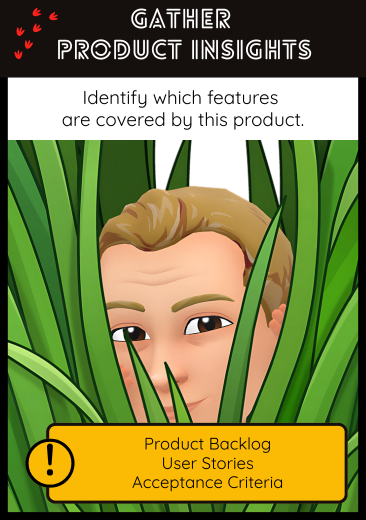

## 🧠 Gather Product Insight  
**Identify which features are covered by this product**

### 🎯 Intent  
Understand the main functional scope of the legacy system by connecting existing code to product expectations. This helps establish shared understanding and detect mismatches or obsolete features.

### 🔍 When to Use  
- At the start of a legacy code exploration.  
- When onboarding a new team or new developers.  
- When business knowledge is partially lost or informal.
- To challenge assumptions about what the system *actually* does.

### 🤖 How to Use with AI Assistants  

Use the assistant to help connect product-level descriptions to implementation details.

#### Prompt Examples  
- *"Based on the following code snippet, what business feature or use case does this appear to support?"*  
- *"Here is a list of user stories / acceptance criteria — can you identify corresponding areas in the code?"*  
- *"Does this module seem related to any functional domain like authentication, billing, or reporting?"*  
- *"Given this folder structure and class names, what high-level features can we infer?"*

> 💡 You can combine this with `grep`, `ripgrep`, or search in your IDE to validate hypotheses generated by the assistant.

### 🛠️ Related Craft/Agile Practices  
- **Knowledge Crunching** (from Domain-Driven Design)  
- **Ubiquitous Language**  
- **Example Mapping** (to relate examples, rules, and questions)  
- **Wardley Mapping** (to explore business capabilities, if going deeper)

### 📚 Go Deeper  

- [Ubiquitous Language (Martin Fowler)](https://martinfowler.com/bliki/UbiquitousLanguage.html)  when-you-look-at-a-codebase/)  
- [Example Mapping explained (Cucumber)](https://cucumber.io/blog/bdd/example-mapping-introduction/)
- [Software archeology (Wikipedia)](https://en.wikipedia.org/wiki/Software_archaeology)
- [Legacy code management - A collection or perspectives (Zartis)](https://www.zartis.com/legacy-code-management-a-collection-of-perspectives/)

---