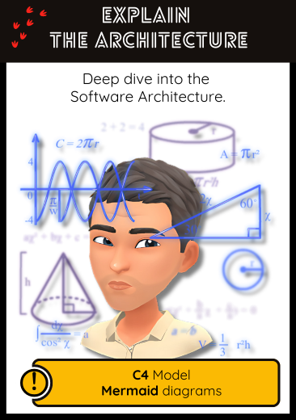

## 🏛️ Explain the Architecture  
**Deep dive into the software architecture**

### 🎯 Intent  
Gain a high-level understanding of how the system is structured, how its parts interact, and what technical boundaries exist. 
The goal is to identify dependencies, areas of risk, and architectural smells before making changes.

### 🔍 When to Use  
- When joining a new project with unclear or outdated documentation  
- Before initiating a refactoring or modernization initiative  
- To facilitate onboarding of new developers  
- To align technical and product discussions using visual representations

### 🤖 How to Use with AI Assistants  

Assistants can help you reconstruct architectural views from code, identify responsibilities, and produce diagrams.

#### Prompt Examples  
- *"Can you describe the main architectural layers in this codebase?"*  
- *"Which modules or components have the most dependencies?"*  
- *"Generate a C4 Model (level 2: Container) based on this folder and class structure."*  
- *"Can you produce a Mermaid diagram of the main modules and how they interact?"*  
- *"Which parts of this code follow a hexagonal architecture?"*

> 🛠️ Combine this with tools like [Structurizr DSL](https://structurizr.com/dsl) or [Mermaid Live Editor](https://mermaid.live/edit) for visualization.

### 🛠️ Related Craft/Agile Practices  
- **C4 Model**: A structured way to describe software architecture across 4 levels of detail  
- **Visual Exploration**: Making architecture visible as a communication tool  
- **Architecture Decision Records (ADR)**: To document decisions and trade-offs over time  

### 📚 Go Deeper  
- [C4 Model by Simon Brown](https://c4model.com/)  
- [Documenting Architecture Decisions](https://adr.github.io/)  
- [Mermaid Syntax Reference](https://mermaid.js.org/intro/syntax-reference.html)  
- [Creating Software Architecture Diagrams with Mermaid, draw.io, and ChatGPT](https://medium.com/@somasharma_81597/creating-software-architecture-diagrams-with-mermaid-draw-io-and-chatgpt-4941fbf4c83a)
- [Structurizr DSL Guide](https://structurizr.com/help/dsl)

---