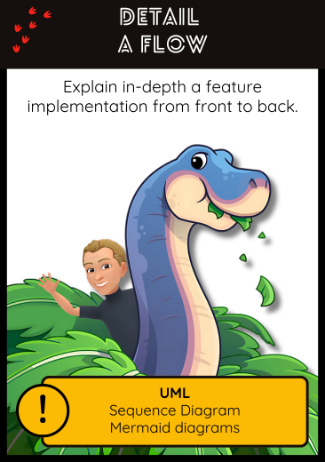

## 🔄 Detail a Flow  
**Explain in-depth a feature implementation from front to back**

### 🎯 Intent  
Understand the internal behavior of a specific feature across layers and components (UI, API, services, persistence). 
Useful for pinpointing responsibilities, debugging, and planning refactors.

### 🔍 When to Use  
- When investigating how a feature works end-to-end
- To clarify business rules and technical paths in legacy systems
- Before implementing tests or doing targeted refactoring
- To support handovers and documentation of complex behavior

### 🤖 How to Use with AI Assistants  

AI tools can extract and visualize execution paths, build sequence diagrams, and summarize logic across layers.

#### Prompt Examples  
- *"Can you trace what happens when the user clicks the ‘Submit’ button?"*  
- *"Show the method call chain from the controller to the database."*  
- *"Generate a Mermaid sequence diagram for the login process."*  
- *"Explain the flow of data through this feature, including validations and side effects."*  
- *"Which services or components are involved when this endpoint is called?"*

> 🧩 You can copy/paste code snippets or entire files into AI tools and ask for flow reconstruction. Combining this with tools like [Mermaid](https://mermaid.js.org/) or [PlantUML](https://plantuml.com/) allows visual validation and sharing.

### 🛠️ Related Craft/Agile Practices  
- **UML & Sequence Diagrams**: To document and communicate dynamic interactions  
- **Behavioral Design Analysis**: Spotting responsibilities and cohesion  
- **Outside-In TDD**: Helps map flows from expected behavior down to implementation  
- **Living Documentation**: Keeping flows understandable and discoverable in evolving systems

### 📚 Go Deeper  
- [Mermaid Sequence Diagrams](https://mermaid.js.org/syntax/sequenceDiagram.html)  
- [PlantUML Sequence Reference](https://plantuml.com/sequence-diagram)  
- [Software Design X-Rays – Adam Tornhill](https://understandlegacycode.com/blog/key-points-of-software-design-x-rays/)

---