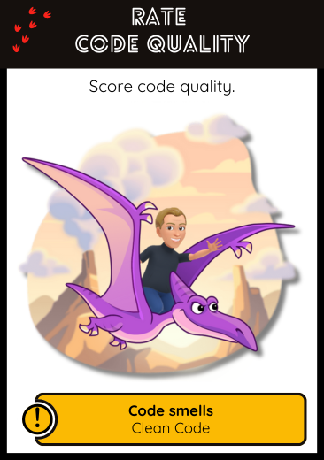

## 🧪 Rate Code Quality  
**Score code quality**

### 🎯 Intent  
Evaluate the quality of code with respect to maintainability, clarity, modularity, and adherence to recognized design principles. 
Use this analysis to prioritize refactoring, guide reviews, or identify hotspots in legacy systems.

### 🔍 When to Use  
- When having to assess and gather metrics on a codebase
- During onboarding or architecture reviews  
- Before starting a critical feature or refactor  
- To identify low-hanging fruit for code improvement  
- When introducing craft practices to a team

### 🤖 How to Use with AI Assistants  

Assistants can review code snippets and provide observations on design flaws, naming, cohesion, duplication, and violation of principles like SOLID or Object Calisthenics.

#### Prompt Examples  
- *"Give me a high-level assessment of this codebase. What stands out in terms of quality, structure, and maintainability?"*
- *"List the top 5 areas of concern in this project and explain why they matter."*
- *"Score this codebase on a scale from 1 (poor) to 5 (excellent) in terms of code readability, testability, and separation of concerns."*
- *"Which principles of SOLID are most frequently broken across this module?"*
- *"How testable is this code? What makes it hard or easy to write tests for it?"*
- *"Evaluate this API design according to the Richardson Maturity Model. What would be needed to reach the next level?"*
- *"Does this service follow a clean architecture (e.g. hexagonal)? Explain any deviations."*
- *"Suggest refactoring opportunities that would provide high impact for low effort."*
- *"Create a table of technical debt issues found, with estimated fix effort (S/M/L) and potential business value (Low/Medium/High)."*

💡 Tip: Copy/paste small, self-contained units of code (functions, classes, or controllers) to get precise, relevant feedback.

### 📉 What AI Can’t Do (Yet)  
Some code quality aspects require static or dynamic tooling, which goes beyond what AI alone can assess:

- **Static code analysis**: for cyclomatic complexity, duplication, dead code  
- **Security and dependency scanning**: for known vulnerabilities (e.g. CVEs)  
- **Code coverage and mutation testing**  
- **Runtime performance bottlenecks**

📌 Use tools like [SonarQube](https://www.sonarsource.com/products/sonarqube/), [LibYear](https://libyear.com), [Dependabot](https://github.com/dependabot), or [OWASP Dependency-Check](https://owasp.org/www-project-dependency-check/) in conjunction with AI assistants.

### 🛠️ Related Craft/Agile Practices  
- **Clean Code & Code Smells (Martin, Fowler)**  
- **SOLID principles**  
- **Object Calisthenics**: 9 discipline rules for better OOP design  
- **Richardson Maturity Model**: scoring the RESTfulness of an API  
- **Refactoring Patterns**: safe and incremental design improvements  
- **Code Review Culture**: collective learning and shared ownership

### 📚 Go Deeper  
- [Object Calisthenics – Rules Explained](https://williamdurand.fr/2013/06/03/object-calisthenics/)  
- [The SOLID Principles in Pictures](https://medium.com/backticks-tildes/the-s-o-l-i-d-principles-in-pictures-b34ce2f1e898)  
- [Code Smells](https://refactoring.guru/refactoring/smells)  
- [Richardson Maturity Model Explained](https://martinfowler.com/articles/richardsonMaturityModel.html)  
- [The Clean Code Talks – Google Tech Talk](https://www.youtube.com/watch?v=7EmboKQH8lM)  
- [SonarQube Static Analysis](https://docs.sonarsource.com/sonarqube/latest/)  
- [OWASP Dependency Check](https://owasp.org/www-project-dependency-check/)

---