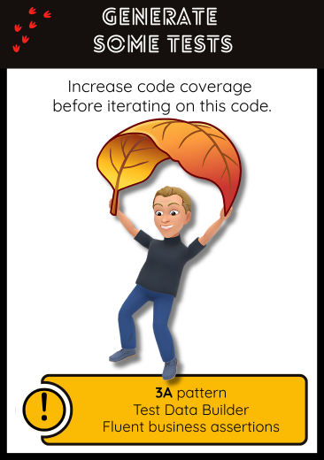

## 🧪 Generate Some Tests
**Increase code coverage before iterating on this code**



### 🎯 Intent  
Create or regenerate missing tests to protect existing behavior, reduce risk, and prepare for safe refactoring. Good tests serve as a safety net and help understand undocumented business logic.

### 🔍 When to Use  
- Before changing legacy code that lacks automated tests  
- When trying to reproduce or isolate a bug  
- After reverse-engineering code behavior through debugging  
- As a first step in transforming code through the "Golden Master" or "Characterization Testing"

### 🤖 How to Use with AI Assistants  

AI can analyze code behavior, infer test scenarios, and generate unit or integration tests that follow clean testing practices.

#### Prompt Examples  
- *"Generate unit tests for this class following the Arrange-Act-Assert pattern."*  
- *"What are the edge cases I should test for this method?"*  
- *"Write a test using a test data builder to create a valid business object."*  
- *"Generate fluent assertions that describe the expected business behavior."*  
- *"Can you create characterization tests to capture the current behavior of this legacy method?"*

💡 Combine with code coverage tools (e.g. Coverlet, dotCover, Visual Studio Test Explorer) to identify untested paths and validate improvements.

### 🧱 Patterns to Apply  
- **3A Pattern (Arrange-Act-Assert)**  
Clearly structure the test for readability and debugging.
```csharp
// Arrange
var cart = new Cart();
cart.AddItem("book", 2);
// Act
var total = cart.GetTotal();
// Assert
Assert.Equal(40.00, total);
```
- **Test Data Builders**  
Build test objects fluently, reducing duplication and highlighting the essential aspects of the test.
```csharp
var user = UserBuilder
  .AnAdmin()
  .WithEmail("test@domain.com")
  .Build();
```
- **Fluent Business Assertions**  
Make tests read like business rules
```csharp
order.ShouldBeConfirmed()
  .WithTotal(100.0)
  .AndHaveItemCount(3);
```
### 🛠️ Related Craft/Agile Practices  
- **Legacy Code Transformation Patterns**
- **"Characterization Tests" (Michael Feathers)**
- **Golden Master Testing for non-deterministic or complex legacy logic**
- **Living Documentation via expressive tests**
- **TDD & Outside-In TDD: Build tests from the interface inward**

### 📚 Go Deeper  
- [Working Effectively with Legacy Code – Michael Feathers](https://www.oreilly.com/library/view/working-effectively-with/0131177052/)
- [Test Data Builder](https://xtrem-tdd.netlify.app/flavours/testing/test-data-builders/)
- [Fluent Assertions for .NET](https://xtrem-tdd.netlify.app/Flavours/Testing/fluent-assertions)
- [Characterization Testing - Michael Feathers](https://michaelfeathers.silvrback.com/characterization-testing)
- [Snapshot testing in .NET with Verify](https://blog.jetbrains.com/dotnet/2024/07/11/snapshot-testing-in-net-with-verify/)

---