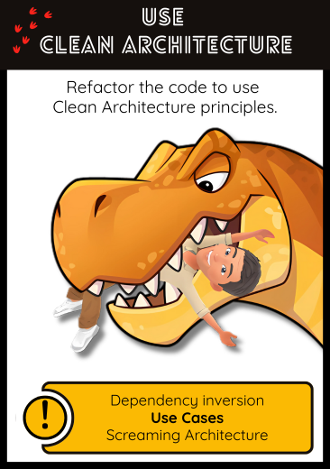

## 🏛️ Use Clean Architecture  
**Refactor the code to use clean architecture principles**

### 🎯 Intent  
Introduce architectural boundaries that separate concerns, highlight domain logic, and make the system easier to understand, evolve, and test. Clean Architecture facilitates a clear mental model for developers and accelerates onboarding and feature delivery.

### 🔍 When to Use  
- When business logic is scattered across controllers, services, and infrastructure  
- When introducing tests or improving maintainability in legacy code  
- As part of a modularization or decoupling initiative  
- When trying to isolate core rules from delivery mechanisms (e.g., UI, APIs)

### 🤖 How to Use with AI Assistants  

Assistants can identify violations of clean architecture, propose new folder structures, extract use cases, and refactor dependencies toward an inverted direction.

#### Prompt Examples  
- *"Identify parts of this code that violate the dependency inversion principle."*  
- *"Can you extract the core business logic into a use case or application service?"*  
- *"Suggest a folder structure based on Clean Architecture principles."*  
- *"Rewrite this controller so that it delegates to an interactor or use case class."*  
- *"Which infrastructure dependencies are leaking into the domain layer?"*  
- *"Can you explain what this codebase is about based on the package/module names?"*

### 🧱 Key Concepts  
- **Screaming Architecture**  
  The folder structure and modules should shout what the app *does*, not how it is delivered (e.g., `/billing/`, `/reporting/` instead of `/controllers/`, `/services/`).

- **Dependency Inversion Principle**  
  High-level policies (business rules) should not depend on low-level details (frameworks, databases).

- **Use Cases / Interactors**  
  Application-specific business rules, clearly separated from controllers and UI logic.

### 🛠️ Related Craft/Agile Practices  
- **Hexagonal Architecture (Ports & Adapters)**  
- **Domain-Driven Design (DDD)**  
- **Testability Through Isolation**  
- **Refactoring Toward Deeper Modularity**

### 📚 Go Deeper  
- [Clean Architecture by Robert C. Martin (Book)](https://www.oreilly.com/library/view/clean-architecture-a/9780134494272/)  
- [Screaming Architecture (Uncle Bob)](https://blog.cleancoder.com/uncle-bob/2011/09/30/Screaming-Architecture.html)  
- [The Clean Architecture – 8-min overview](https://medium.com/@matiasfha/clean-architecture-in-8-minutes-192d948be3e3)  
- [Modular Monoliths](https://awesome-architecture.com/modular-monolith/)
- [.NET Clean Architecture Template](https://github.com/jasontaylordev/CleanArchitecture)

---