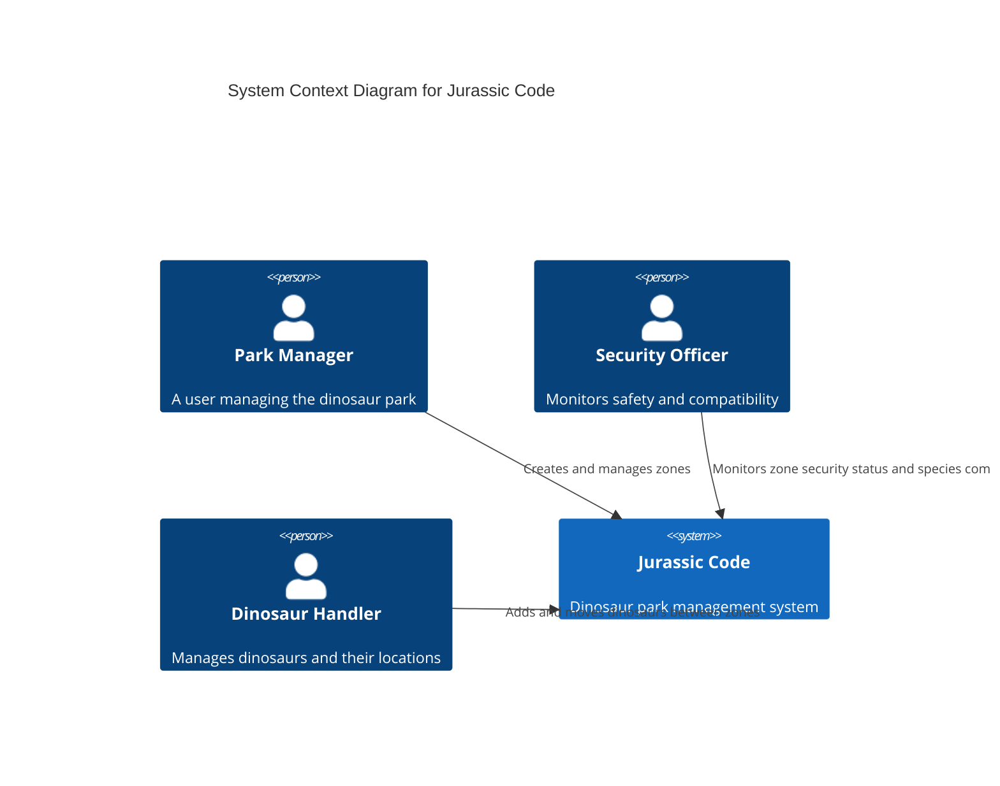
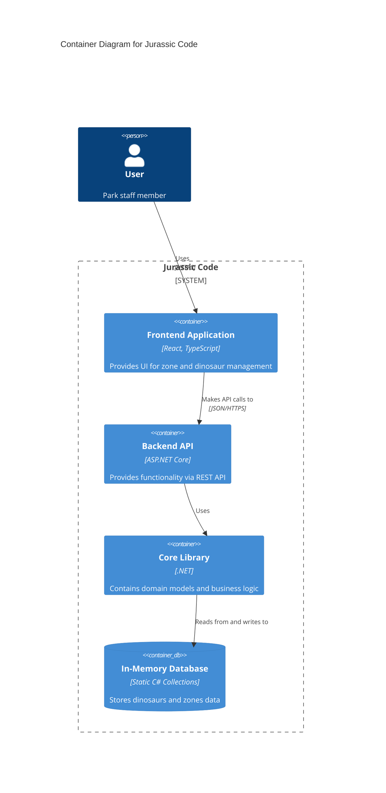
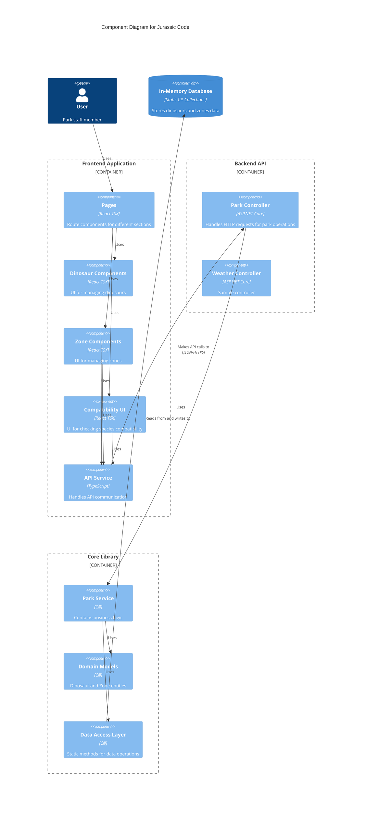
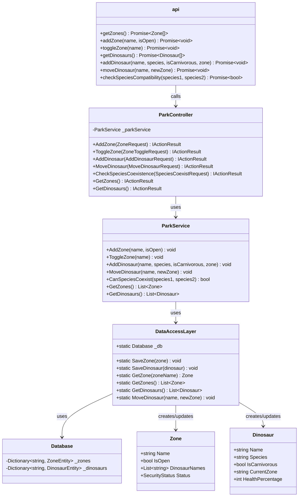

# Jurassic Code - C4 Architecture Diagrams

This document presents the architecture of Jurassic Code using the C4 model, which provides different levels of abstraction to understand the system.

## 1. Context Diagram

The Context diagram shows Jurassic Code as a system and its interactions with users.

## 2. Container Diagram

The Container diagram shows the high-level technical components of Jurassic Code.

## 3. Component Diagram

The Component diagram shows the key functional parts within each container.

## 4. Code Diagram (Class Diagram)

The Code diagram shows the key classes and their relationships.

## Architectural Characteristics

The Jurassic Code architecture has the following key characteristics:

1. **Client-Server Pattern**: React frontend communicating with ASP.NET Core backend via REST API
2. **In-Memory Data Storage**: Uses static collections rather than a persistent database
3. **Limited Separation of Concerns**: Tight coupling between service and data access layers
4. **Static Data Access Layer**: Relies on static methods and global state
5. **Dependency Injection**: Limited to controller level, not fully utilized throughout
6. **Domain Models**: Simple POCOs with minimal validation
7. **API Communication**: JSON payloads with dedicated Request/Response DTOs