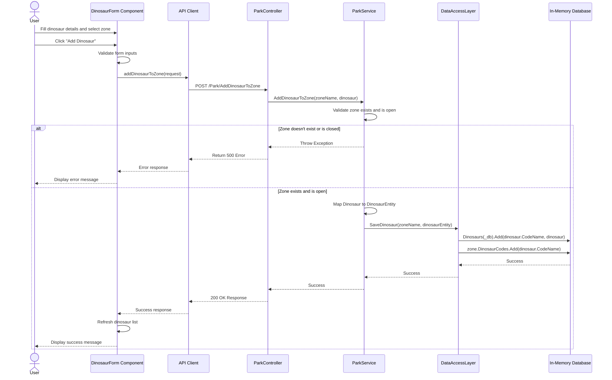
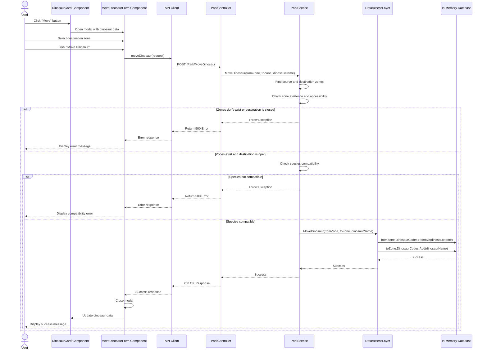

# Dinosaur Management: Sequence Diagram

This document provides a detailed sequence diagram for the two main dinosaur management operations: adding a dinosaur and moving a dinosaur between zones.

## Adding a Dinosaur Sequence

## Moving a Dinosaur Sequence

## Data Flow Explanation

### Adding a Dinosaur:

1. **User Interaction**:
   - User enters dinosaur information (name, species, carnivore status)
   - User selects a destination zone
   - User submits the form

2. **Frontend Processing**:
   - Form validates inputs
   - Creates `AddDinosaurRequest` object
   - Calls API client

3. **API Communication**:
   - API client makes POST request to `/Park/AddDinosaurToZone`
   - Controller receives request and delegates to service

4. **Business Logic**:
   - Service validates zone exists and is open
   - Maps domain model to entity
   - Calls data access layer

5. **Data Storage**:
   - Data access layer adds dinosaur to in-memory collections
   - Updates zone to reference the new dinosaur

6. **Response Flow**:
   - Success/failure propagates back through layers
   - UI updates to show the new dinosaur or error message

### Moving a Dinosaur:

1. **User Interaction**:
   - User selects dinosaur and clicks "Move"
   - User selects destination zone in modal
   - User confirms move

2. **Frontend Processing**:
   - Creates `MoveDinosaurRequest` object
   - Calls API client

3. **API Communication**:
   - API client makes POST request to `/Park/MoveDinosaur`
   - Controller receives request and delegates to service

4. **Business Logic**:
   - Service validates zones exist and destination is open
   - Checks species compatibility in destination zone
   - Calls data access layer

5. **Data Storage**:
   - Data access layer removes dinosaur from source zone
   - Adds dinosaur to destination zone

6. **Response Flow**:
   - Success/failure propagates back through layers
   - UI updates to show dinosaur in new zone or error message

## Technical Characteristics

1. **Synchronous Processing**: All operations are handled synchronously
2. **In-Memory Data**: No persistence beyond application lifetime
3. **Validation Bottlenecks**: Business logic layer handles most validations
4. **Error Propagation**: Exceptions bubble up through the stack
5. **UI Feedback**: User receives success/error messages after operations complete