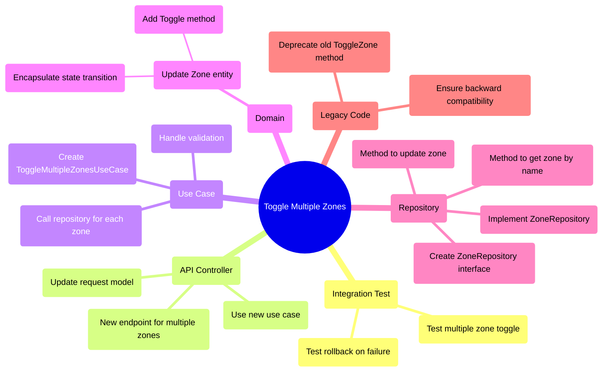
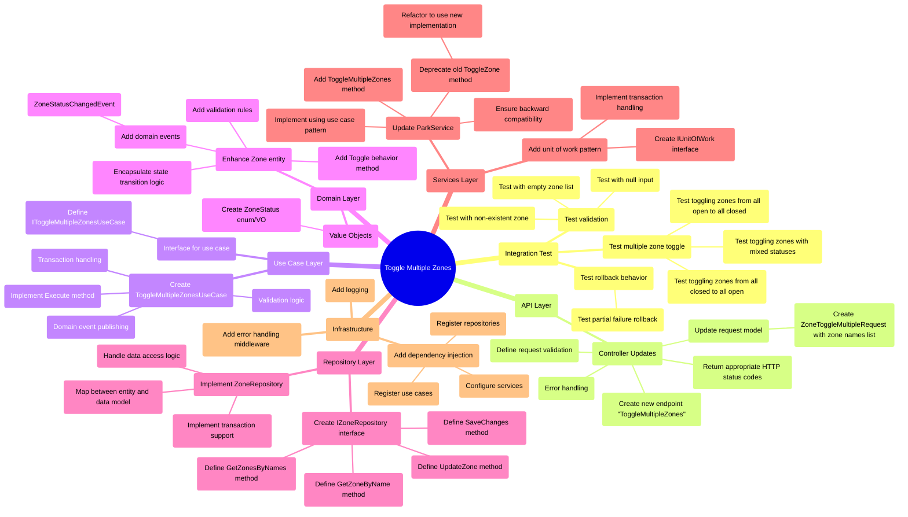
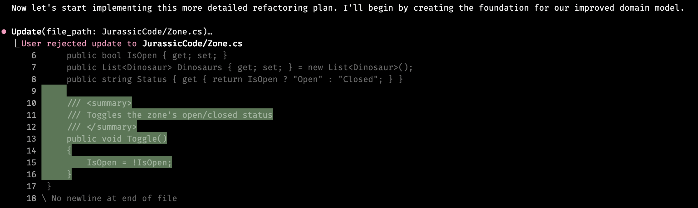

## Refactor some code
### In-depth
```prompt
Refactor the "Toggle Zone" feature. 
Now users must be able to "Toggle multiple zones".

Before starting any refactoring generate a Mikado graph (use mind map through mermaid) to refactor this code using :
- Outside-In TDD (starting from an integration / acceptance test)
- Use Sprout Method
- Create a Use Case class to handle this feature
- Encapsulate Data access in a Repository
- Use Domain Entities to encapsulate State Transition and business rules
- Ensure Tell Don't Ask principle
- End-up the refactoring by replacing the previous method
```

Here is the result:



```prompt
Go futher in the mikado graph. more in-depth
```





```prompt
Start with a first integration test using a double tdd loop to implement the feature
```

```csharp
 [Fact]
 public void TestToggleMultipleZones_Integration()
 {
 // Setup
    DataAccessLayer.Init(new Database());
    _parkService.AddZone("MultiZone1", true);
    _parkService.AddZone("MultiZone2", true);
    _parkService.AddZone("MultiZone3", false);
    
    // Get initial zone states
    var initialZones = _parkService.GetAllZones().ToList();
    initialZones.Should().Contain(z => z.Name == "MultiZone1" && z.IsOpen);
    initialZones.Should().Contain(z => z.Name == "MultiZone2" && z.IsOpen);
    initialZones.Should().Contain(z => z.Name == "MultiZone3" && !z.IsOpen);
    
    // Act - toggle multiple zones at once
    var zoneNames = new List<string> { "MultiZone1", "MultiZone2", "MultiZone3" };
    _parkService.ToggleMultipleZones(zoneNames);
    
    // Assert - all zones should have their status toggled
    var zones = _parkService.GetAllZones().ToList();
    zones.Should().Contain(z => z.Name == "MultiZone1" && !z.IsOpen);
    zones.Should().Contain(z => z.Name == "MultiZone2" && !z.IsOpen);
    zones.Should().Contain(z => z.Name == "MultiZone3" && z.IsOpen);
    
    // Toggle them back
    _parkService.ToggleMultipleZones(zoneNames);
    
    // Assert they're back to original state
    var finalZones = _parkService.GetAllZones().ToList();
    finalZones.Should().Contain(z => z.Name == "MultiZone1" && z.IsOpen);
    finalZones.Should().Contain(z => z.Name == "MultiZone2" && z.IsOpen);
    finalZones.Should().Contain(z => z.Name == "MultiZone3" && !z.IsOpen);
}
```

```prompt
Do not assert anything before calling the behavior under test
Avoid duplication in the code : use constants here and create custom assertions to express in business terms the assertion (zones.MustBeOpened(zone1, zone2) for example)
```

```csharp
[Fact]                                                                                                                                                                                                                                                            │ │
public void TestToggleMultipleZones_Integration()                                                                                                                                                                                                                 │ │
{                                                                                                                                                                                                                                                                 │ │
    // Setup                                                                                                                                                                                                                                                      │ │
    DataAccessLayer.Init(new Database());                                                                                                                                                                                                                         │ │
    _parkService.AddZone(ZoneA, true);                                                                                                                                                                                                                            │ │
    _parkService.AddZone(ZoneB, true);                                                                                                                                                                                                                            │ │
    _parkService.AddZone(ZoneC, false);                                                                                                                                                                                                                           │ │
                                                                                                                                                                                                                                                                  │ │
    // Act - toggle multiple zones at once                                                                                                                                                                                                                        │ │
    var zoneNames = new List<string> { ZoneA, ZoneB, ZoneC };                                                                                                                                                                                                     │ │
    _parkService.ToggleMultipleZones(zoneNames);                                                                                                                                                                                                                  │ │
                                                                                                                                                                                                                                                                  │ │
    // Assert - all zones should have their status toggled                                                                                                                                                                                                        │ │
    var zones = _parkService.GetAllZones().ToList();                                                                                                                                                                                                              │ │
    zones.ShouldHaveZonesWithStatus(                                                                                                                                                                                                                              │ │
        (ZoneA, false),                                                                                                                                                                                                                                           │ │
        (ZoneB, false),                                                                                                                                                                                                                                           │ │
        (ZoneC, true)                                                                                                                                                                                                                                             │ │
    );                                                                                                                                                                                                                                                            │ │
}  
```

```csharp
// In the Controller
public void ToggleMultipleZones(IEnumerable<string> zoneNames)
{
    // Use the Use Case pattern to handle the operation
    var zoneRepository = new ZoneRepository();
    var toggleMultipleZonesUseCase = new UseCases.ToggleMultipleZonesUseCase(zoneRepository);
    
    // Execute the use case
    toggleMultipleZonesUseCase.Execute(zoneNames);
}
 
// In the ParkService
public void ToggleMultipleZones(IEnumerable<string> zoneNames)
{
    // Use the Use Case pattern to handle the operation
    var zoneRepository = new ZoneRepository();
    var toggleMultipleZonesUseCase = new UseCases.ToggleMultipleZonesUseCase(zoneRepository);
    
    // Execute the use case
    toggleMultipleZonesUseCase.Execute(zoneNames);
}

public class ToggleMultipleZonesUseCase : IToggleMultipleZonesUseCase
{
    private readonly IZoneRepository _zoneRepository;
    
    public ToggleMultipleZonesUseCase(IZoneRepository zoneRepository)
    {
        _zoneRepository = zoneRepository;
    }
    
    public void Execute(IEnumerable<string> zoneNames)
    {
        // Validate input
        if (zoneNames == null || !zoneNames.Any())
        {
            throw new Exception("No zones specified for toggling.");
        }
        
        // Get all zones at once
        var zones = _zoneRepository.GetZonesByNames(zoneNames);
        
        // Verify all zones exist
        if (zones.Count != zoneNames.Count())
        {
            throw new Exception("One or more zones do not exist.");
        }
        
        // Toggle each zone's status
        foreach (var zone in zones)
        {
            zone.Toggle();
            _zoneRepository.SaveZone(zone);
        }
    }
}

public class Zone
{
    public string Name { get; set; }
    public bool IsOpen { get; set; }
    public List<Dinosaur> Dinosaurs { get; set; } = new List<Dinosaur>();
    public string Status { get { return IsOpen ? "Open" : "Closed"; } }
    
    /// <summary>
    /// Toggles the zone's open/closed status
    /// </summary>
    public void Toggle()
    {
        IsOpen = !IsOpen;
    }
}
```

It did not used the learning from the `Mikado` graph...


```csharp
public void Execute(string[] zoneNames) 
    => CheckZones(zoneNames)
        .Do(zones => _zoneRepository
            .GetZonesByNames(zoneNames)
            .ForEach(Save);
```