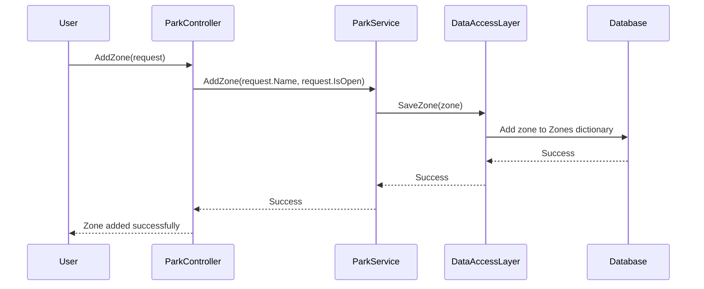
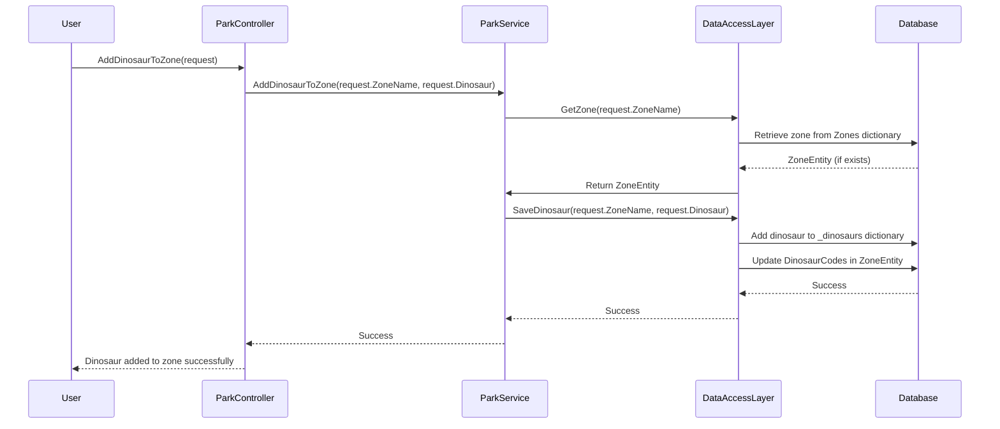
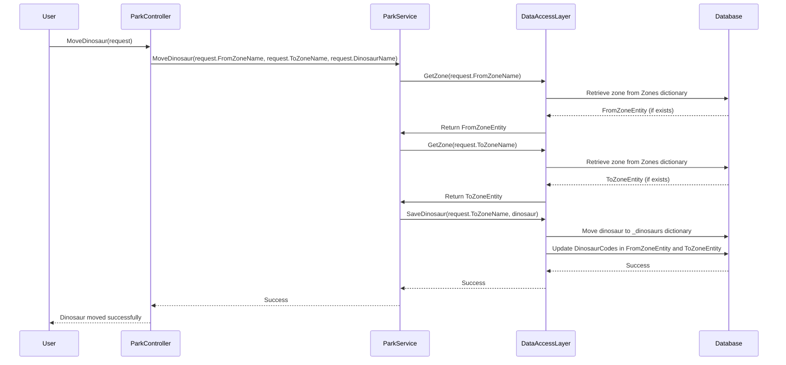
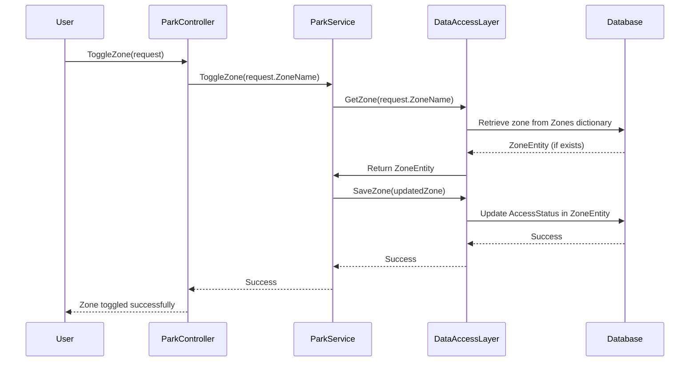
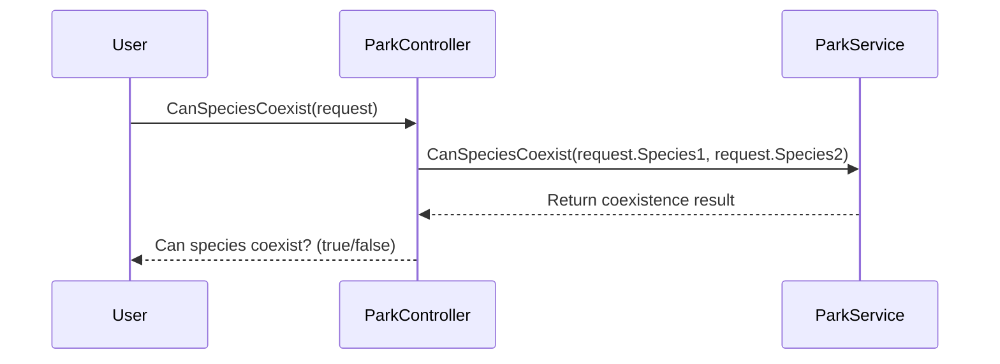
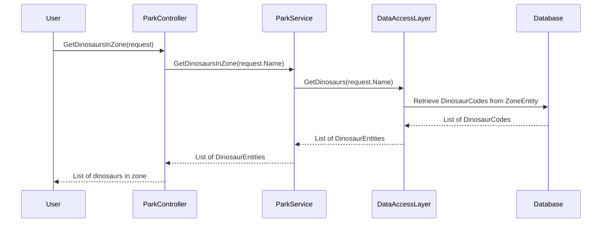
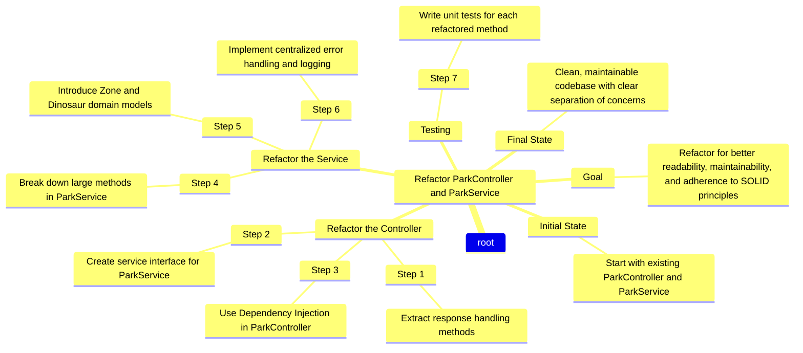

Based on the provided `ParkController` code, we can identify several use cases that correspond to the methods in the controller. Here are the use cases along with their respective sequence diagrams:

### Use Case 1: Add Zone
**Description**: A user requests to add a new zone to the park.



### Use Case 2: Add Dinosaur to Zone
**Description**: A user requests to add a dinosaur to a specific zone.



### Use Case 3: Move Dinosaur
**Description**: A user requests to move a dinosaur from one zone to another.



### Use Case 4: Toggle Zone
**Description**: A user requests to toggle the access status of a zone.



### Use Case 5: Can Species Coexist
**Description**: A user requests to check if two species can coexist.



### Use Case 6: Get Dinosaurs in Zone
**Description**: A user requests to retrieve a list of dinosaurs in a specific zone.



These sequence diagrams represent the interactions for each use case in the `ParkController`. You can visualize these diagrams using a Mermaid live editor or any compatible tool. Let me know if you need further modifications or additional diagrams!

## Mikado graph
Prompt : From this controller I would like to refactor the code to make it more clean (Clean Code, SOLID, Object Calisthenics). Please provide me a mikado graph explaining how should I proceed


Creating a Mikado graph involves visualizing the steps needed to refactor code while considering dependencies and potential impacts. Below is a textual representation of how you might structure a Mikado graph for refactoring the `ParkController` and `ParkService` classes to adhere to Clean Code principles, SOLID principles, and Object Calisthenics.

### Mikado Graph Steps

1. **Identify the Goal**: 
   - Refactor `ParkController` and `ParkService` for better readability, maintainability, and adherence to SOLID principles.

2. **Initial State**: 
   - Start with the existing `ParkController` and `ParkService` classes.

3. **Refactor the Controller**:
   - **Step 1**: Extract methods for handling responses in `ParkController`.
     - **Dependency**: Requires understanding of response handling.
   - **Step 2**: Create a service interface for `ParkService`.
     - **Dependency**: Requires modifying `ParkService` to implement the interface.
   - **Step 3**: Use Dependency Injection for `ParkService` in `ParkController`.
     - **Dependency**: Requires changes in the constructor of `ParkController`.

4. **Refactor the Service**:
   - **Step 4**: Break down large methods in `ParkService` into smaller, single-responsibility methods.
     - **Dependency**: Requires understanding of each method's responsibilities.
   - **Step 5**: Introduce a `Zone` and `Dinosaur` domain model to encapsulate related data and behaviors.
     - **Dependency**: Requires creating new classes and modifying existing methods to use these models.
   - **Step 6**: Implement error handling and logging in a centralized manner.
     - **Dependency**: Requires creating a logging service or utility.

5. **Testing**:
   - **Step 7**: Write unit tests for each refactored method.
     - **Dependency**: Requires understanding of testing frameworks and writing tests.

6. **Final State**:
   - Achieve a clean, maintainable codebase with clear separation of concerns.

### Mikado Graph Representation

```
[Goal: Refactor ParkController and ParkService]
        |
        v
[Step 1: Extract response handling methods]
        |
        v
[Step 2: Create service interface for ParkService]
        |
        v
[Step 3: Use Dependency Injection in ParkController]
        |
        v
[Step 4: Break down large methods in ParkService]
        |
        v
[Step 5: Introduce Zone and Dinosaur domain models]
        |
        v
[Step 6: Implement centralized error handling and logging]
        |
        v
[Step 7: Write unit tests for refactored methods]
        |
        v
[Final State: Clean, maintainable codebase]
```

### Notes:
- Each step should be approached iteratively, ensuring that changes are tested and validated before moving to the next step.
- The dependencies indicate that some steps cannot be completed until previous steps are done.
- This approach helps in managing complexity and ensuring that the refactoring process is systematic and organized.


